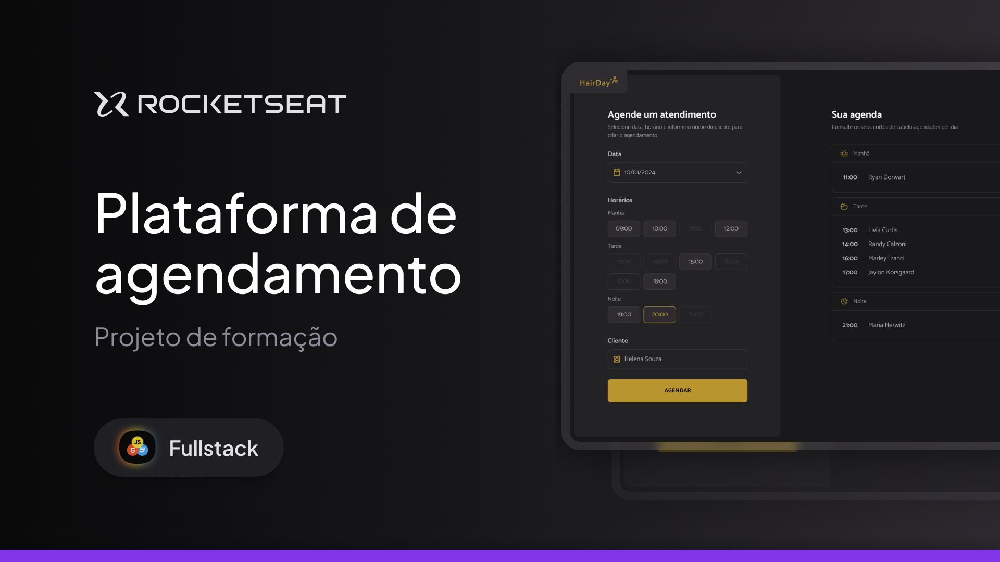

<h1 align="center"> Projeto Plataforma de Agendamento</h1>

Este projeto, desenvolvido em aula, faz parte da trilha Full-Stack, promovido pela Rocketseat para ensino de tecnologias WEB.   

  <a href="#tecnologias">Tecnologias</a>&nbsp;&nbsp;&nbsp;|&nbsp;&nbsp;&nbsp;
  <a href="#projeto">Projeto</a>&nbsp;&nbsp;&nbsp;|&nbsp;&nbsp;&nbsp;
  <a href="#licença">Licença</a>

  

 

  

## Tecnologias

- **HTML5** para estruturação do conteúdo
- **CSS3** para estilização e responsividade.
- **JavaScript** para executar funções, melhorar interatividade e simular uma API. 
- **Google Fonts** para personalização da tipografia

## Projeto

- [PROJECTO](https://project-hair-day.vercel.app/)

## Licença

Esse projeto está sob a licença MIT.

---

